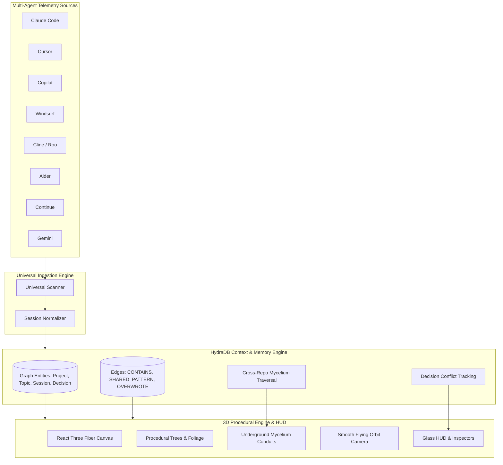

# 🌲 Tracewood

> **Turn the invisible history of AI-assisted coding into a living, queryable 3D forest.**

[](https://www.typescriptlang.org/)
[](https://docs.pmnd.rs/react-three-fiber)
[](https://hackhydra.hydradb.com/)
[](https://opensource.org/licenses/MIT)

**Tracewood** is a local-first application that transforms your AI coding agent telemetry into a living, generative 3D forest. Built on top of **HydraDB** as its core context and episodic memory substrate, Tracewood maps your projects, development themes, agent tool executions, and cross-repo architectural links into organic procedural trees and underground mycelium conduits.

---

## ✨ Features

- **🌲 Procedural Living Forest**: Every repository is an organic tree. Trunks curve with project history, branches represent semantic development themes (topics), and fluffy leaf canopies reflect completed agent sessions.
- **⚡ Zero-Config Universal Ingestion**: Automatically scans and normalizes raw local transcripts across **10+ AI coding agents** on your machine with **zero synthetic seed data**:
  - Claude Code
  - Cursor & VS Code Workspace Telemetry
  - GitHub Copilot & VS Code Chat
  - Windsurf / Codeium
  - Cline / Roo Code
  - Aider CLI
  - Continue.dev
  - Google Gemini / Antigravity
  - OpenAI Codex / OpenCode
  - Pi / Factory / CommandCode
- **🍄 Underground Mycelium Network (HydraDB)**: Visualizes cross-repository semantic links as bioluminescent conduits glowing beneath the forest floor.
- **⚠️ Agent Decision Conflict & Overwrite Detection**: Tracks when agents revised, reversed, or overwrote prior architectural rules.
- **🎥 Smooth 360° Mouse Navigation**: Orbit, pan, zoom, and smoothly fly to any tree, branch, or leaf canopy.
- **🛡️ Privacy-First & Local-First**: Runs 100% locally on your machine with an optional **Shareable Mode** that anonymizes project names, paths, and filenames for public demos.

---

## 🏛 Architecture Overview



---

## 🛠 Tech Stack

- **Core & Runtime**: TypeScript, Node.js (ESM), Vite
- **3D Graphics & Shaders**: Three.js, React Three Fiber (`@react-three/fiber`), `@react-three/drei`
- **Graph & Context Substrate**: [HydraDB](https://hackhydra.hydradb.com/) (`src/database/hydra.ts`) + SQLite persistence
- **State Management**: Zustand
- **Styling**: TailwindCSS, Lucide Icons, Glassmorphism design tokens

---

## 🚀 Quickstart

### Prerequisites
- Node.js (>= 18.0.0)
- npm or pnpm

### Installation

```bash
# Clone repository
git clone https://github.com/your-username/tracewood.git
cd tracewood

# Install dependencies
npm install

# Run development server (serves 3D UI + embedded backend on port 5173)
npm run dev
```

Open `http://localhost:5173` in your browser. Tracewood will automatically discover the coding agents installed on your machine and render your personalized 3D forest!

---

## 🧑‍💻 Code Snippets

### 1. Ingesting Multi-Agent Telemetry into HydraDB

```typescript
import { hydra } from './database/hydra.js';

// Ingest a project entity into the HydraDB graph
hydra.addNode({
  id: projectId,
  type: 'Project',
  label: projectName,
  properties: { path: projectPath },
  timestamp: new Date().toISOString()
});

// Link project to a development theme (Topic)
hydra.addEdge(projectId, topicId, 'CONTAINS');

// Detect and link decision overrides (LongMemEval Track 3)
if (session.intent === 'refactor' || session.intent === 'bugfix') {
  hydra.addNode({
    id: `decision_${session.id}`,
    type: 'DecisionNode',
    label: `Refactor in ${topic.name}`,
    properties: { description: session.summary },
    timestamp: session.startedAt
  });
  hydra.addEdge(session.id, `decision_${session.id}`, 'OVERWROTE', {
    reason: session.summary
  });
}
```

### 2. Computing Underground Mycelium Connections

```typescript
// Traverse graph to find repos sharing architectural themes
const myceliumLinks = hydra.getMyceliumLinks();
// Returns: [{ sourceProjectId, targetProjectId, topic, strength, reason }, ...]
```

---

## 🤝 How to Fork & Contribute

We welcome contributions! Here are some high-impact features you can build:

1. **🌲 Custom Tree Shaders & Biomes**: Add seasonal weather effects (rain, snow, autumn leaf-fall) based on agent velocity.
2. **🔌 Model Context Protocol (MCP) Server**: Expose HydraDB memory as an MCP endpoint so Cursor and Claude Code can query past sessions directly from their editor.
3. **📦 Dependency Blast Radius Simulation**: Parse `package.json` / `requirements.txt` into HydraDB to visually trace transitive security vulnerabilities across your trees.
4. **📊 Git Heatmap Integration**: Overlay git commit frequency onto tree bark textures.
5. **🕶️ WebXR / VR Support**: Walk through your coding forest in virtual reality using WebXR.

### Contribution Steps
1. Fork the repository.
2. Create your feature branch (`git checkout -b feature/amazing-feature`).
3. Commit your changes (`git commit -m 'Add amazing feature'`).
4. Push to the branch (`git push origin feature/amazing-feature`).
5. Open a Pull Request.

---

## 👤 Author

Built with 🌲 by **[Harish Kotra](https://harishkotra.me)**  
*Explore more projects at **[DailyBuild](https://dailybuild.xyz)***

---

## 📄 License

This project is licensed under the MIT License - see the [LICENSE](LICENSE) file for details.
