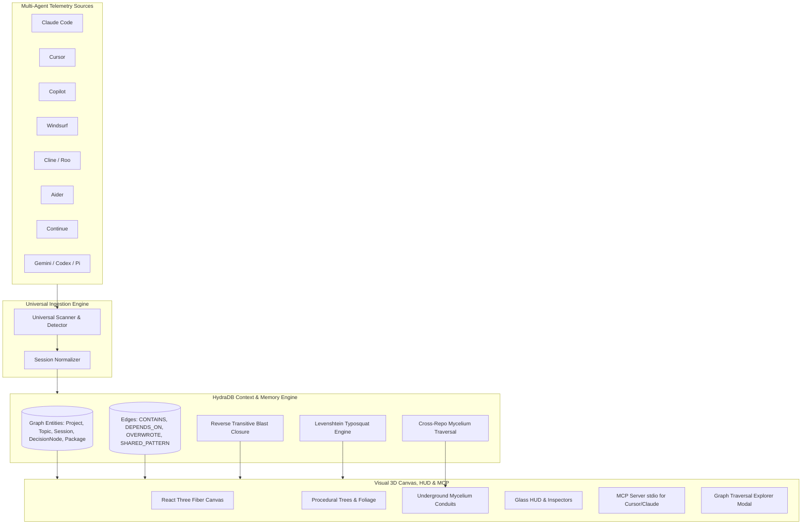

# Tracewood

> **Turn the invisible history of AI-assisted coding into a living, queryable 3D forest.**

[](https://www.typescriptlang.org/)
[](https://docs.pmnd.rs/react-three-fiber)
[](https://hackhydra.hydradb.com/)
[](https://opensource.org/licenses/MIT)

**Tracewood** is a local-first application that transforms your AI coding agent telemetry into a living, generative 3D forest. Built on top of **HydraDB** as its core context and episodic memory substrate, Tracewood maps your projects, development themes, agent tool executions, and cross-repo architectural links into organic procedural trees and underground mycelium conduits.

#### Screenshots


---

## Features

- **Procedural Living Forest**: Every repository is an organic tree. Trunks curve with project history, branches represent semantic development themes (topics), and fluffy leaf canopies reflect completed agent sessions.
- **Zero-Config Universal Ingestion & Harness Permissioning**: Automatically discovers and normalizes local transcripts across **10+ AI coding agents** (Claude Code, Cursor, Copilot, Windsurf, Cline, Aider, Continue, Gemini, Codex, Pi/Factory) with explicit local permission controls.
- **Multi-Select Project Renderer**: Interactively toggle and filter which repositories are visualized on your 3D canvas with dynamic phyllotaxis layout recalculation.
- **Model Context Protocol (MCP) Server**: Exposes a native JSON-RPC MCP server (`src/mcp/server.ts`) over stdio, allowing IDE agents in Cursor and Claude Code to query HydraDB memory, architectural decisions, and dependency blast radius mid-session.
- **Transitive Dependency & Typosquatting Shockwaves**: Computes reverse dependency closures and Levenshtein typosquatting distances in HydraDB to simulate supply chain vulnerability impact with glowing 3D shockwave particle pulses.
- **HydraDB Sub-Graph Traversal Explorer**: Interactive query console to filter nodes (`Project`, `Topic`, `Session`, `DecisionNode`, `Package`) and directional edges (`CONTAINS`, `DEPENDS_ON`, `OVERWROTE`, `SHARED_PATTERN_WITH`).
- **Underground Mycelium Network (HydraDB)**: Visualizes cross-repository semantic links as bioluminescent conduits glowing beneath the forest floor.
- **Agent Decision Conflict & Overwrite Detection**: Tracks when agents revised, reversed, or overwrote prior architectural rules.
- **Smooth 360° Mouse Navigation**: Orbit, pan, zoom, and smoothly fly to any tree, branch, or leaf canopy.
- **Privacy-First & Local-First**: Runs 100% locally on your machine with an optional **Shareable Mode** that anonymizes project names, paths, and filenames for public demos.

---

## Architecture Overview



---

## Tech Stack

- **Core & Runtime**: TypeScript, Node.js (ESM), Vite
- **3D Graphics & Shaders**: Three.js, React Three Fiber (`@react-three/fiber`), `@react-three/drei`
- **Graph & Context Substrate**: [HydraDB](https://hackhydra.hydradb.com/) (`src/database/hydra.ts`) + SQLite persistence
- **Agent Integration**: Model Context Protocol (MCP) Server (`src/mcp/server.ts`)
- **State Management**: Zustand
- **Styling**: TailwindCSS, Lucide Icons, Glassmorphism design tokens

---

## Quickstart

### Prerequisites
- Node.js (>= 18.0.0)
- npm or pnpm

### Installation

```bash
# Clone repository
git clone https://github.com/harishkotra/tracewood.git
cd tracewood

# Install dependencies
npm install

# Run development server (serves 3D UI + embedded backend on port 5173)
npm run dev
```

Open `http://localhost:5173` in your browser. Tracewood will automatically discover the coding agents installed on your machine and render your personalized 3D forest!

---

## Code Snippets

### 1. Ingesting Multi-Agent Telemetry into HydraDB

```typescript
import { hydra } from './database/hydra.js';

// Ingest a project entity into the HydraDB graph
hydra.addNode({
  id: projectId,
  type: 'Project',
  label: projectName,
  properties: { path: projectPath },
  timestamp: new Date().toISOString()
});

// Link project to a development theme (Topic)
hydra.addEdge(projectId, topicId, 'CONTAINS');

// Detect and link decision overrides
if (session.intent === 'refactor' || session.intent === 'bugfix') {
  hydra.addNode({
    id: `decision_${session.id}`,
    type: 'DecisionNode',
    label: `Refactor in ${topic.name}`,
    properties: { description: session.summary },
    timestamp: session.startedAt
  });
  hydra.addEdge(session.id, `decision_${session.id}`, 'OVERWROTE', {
    reason: session.summary
  });
}
```

### 2. Transitive Reverse Dependency Closure in HydraDB

```typescript
// Reverse transitive dependency impact traversal
const blastRadius = hydra.getDependencyBlastRadius('express');
// Returns: { packageName: 'express', affectedProjectIds: [...], blastPercentage: 85 }

// Detect nearby typosquatting variants
const typosquats = hydra.detectTyposquats('express');
// Returns: ['expres', 'express-js']
```

---

## How to Fork & Contribute

We welcome contributions! Here are some high-impact features you can build:

1. **Custom Tree Shaders & Biomes**: Add seasonal weather effects (rain, snow, autumn leaf-fall) based on agent velocity.
2. **Model Context Protocol (MCP) Extensions**: Add custom MCP tools for git commit blame analysis or test suite integration.
3. **Git Heatmap Integration**: Overlay git commit frequency onto tree bark textures.
4. **WebXR / VR Support**: Walk through your coding forest in virtual reality using WebXR.

### Contribution Steps
1. Fork the repository.
2. Create your feature branch (`git checkout -b feature/amazing-feature`).
3. Commit your changes (`git commit -m 'Add amazing feature'`).
4. Push to the branch (`git push origin feature/amazing-feature`).
5. Open a Pull Request.

---

## License

This project is licensed under the MIT License - see the [LICENSE](LICENSE) file for details.
